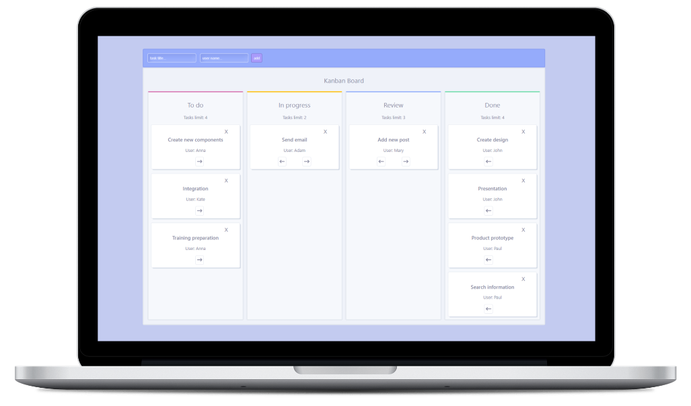

# React Kanban Board

 

A Kanban board is a tool that provides a visual system for teams to manage project tasks, workflows and communication.

 ## :bulb: Project opportunities:
- adding new tasks with assigned user
- each column has a specific task limit
- moving tasks between columns
- deleting task
- using **Local Storage** to adding and deleting tasks

 ## :hammer_and_pick: Technologies
 

&nbsp;

## :gear: Installation

The project uses [node](https://nodejs.org/en/), [npm](https://www.npmjs.com/).

To run it locally you should install all dependencies:

    npm i

To run webpack and create a localhost port you should type:

    npm start

&nbsp;

## :envelope_with_arrow: Feel free to contact me
The project was coded by Anna Królikowska

Find me on [**LINKEDIN**](https://www.linkedin.com/in/krolikowska-ann/) or [**GitHub**](https://github.com/annakrolikowska)
